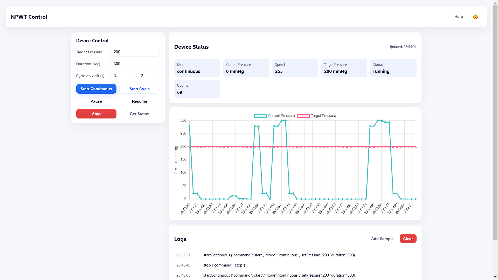
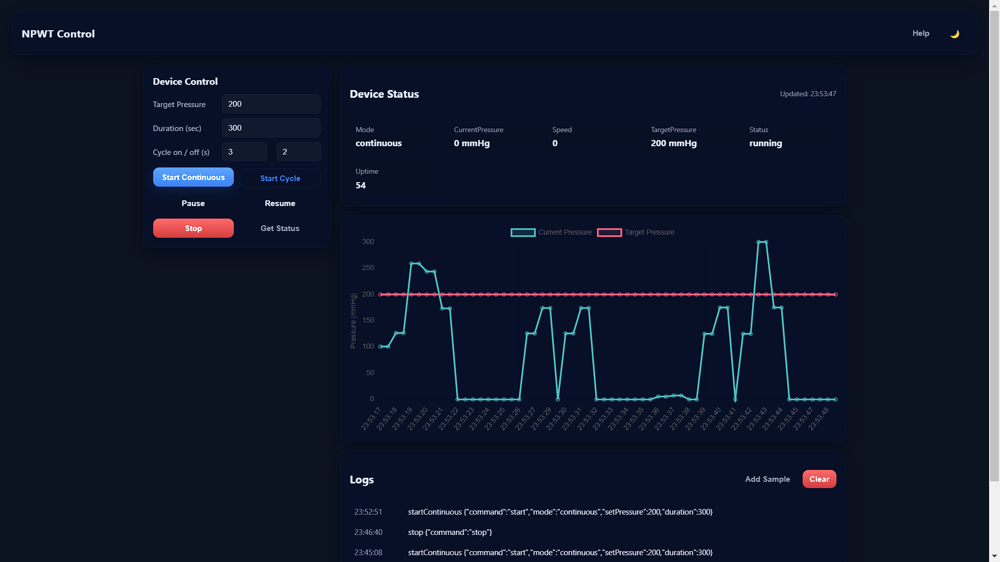

# NPWT Frontend

Negative Pressure Wound Therapy (NPWT) — Frontend UI  
A lightweight React frontend for controlling and monitoring an NPWT device. This app provides controls to start/stop therapies, view device status, and see action logs.

## Features

- Control panel to start continuous or cyclic therapy, pause/resume, stop, and fetch status
- Live status panel with formatted values and last-updated timestamp
- Logs panel recording sent commands and errors
- Light / Dark mode theme toggle
- Small, responsive UI suitable for desktop and tablet

## Screenshots / Images

Add screenshots to the repo and reference them here for quick visual documentation. Recommended location: `public/images/` or `docs/images/`.

Example gallery (place the image files in the indicated paths):

- Light mode (initial)
  

- Dark mode
  

Notes:

- Filenames above are suggestions — update the paths in this README if you place images elsewhere.
- Recommended size: 1200×700px for hero images, 800×450 for detail shots. Use PNG or JPG.
- To capture screenshots: run `npm start`, open http://localhost:3000, set theme, and take screenshots of the areas you want to document.

## Prerequisites

- Node.js >= 14 and npm
- NPWT backend API running and reachable (default expected at http://localhost:8080)

## Local setup

1. Install dependencies
   npm install

2. Configure backend URL (optional)

   - Default API base is `http://localhost:8080/api/device`
   - To change, update `src/api/npwtApi.js` or use an environment mechanism you prefer.

3. Run development server
   npm start

   - Open http://localhost:3000

4. Build for production
   npm run build

## API (frontend expectations)

- POST /api/device/command
  - Body: JSON command object (examples below)
- GET /api/device/status
  - Returns device status JSON

Command payload examples:

- Start continuous
  `{ "command": "start", "mode": "continuous", "setPressure": 100, "duration": 10 }`
- Start cycle
  `{ "command": "start", "mode": "cycle", "setPressure": 120, "duration": 20, "onTime": 5, "offTime": 3 }`
  `{ "command": "pause" } | { "command": "resume" } | { "command": "stop" } | { "command": "status" }`

The frontend dispatches a custom window event `npwt:command` after commands are sent; the logs panel listens for this to display command history.

## UI guide

- Left sidebar: Control panel — set pressure, duration, cycle on/off, then use action buttons.
- Main area: Status cards with key/value display and a Logs panel below showing recent actions and errors.
- Use the theme toggle in the header to switch Light / Dark mode — preference is saved to `localStorage`.

## Adding screenshots quickly

1. Create directory: `mkdir -p public/images` (or `docs/images`)
2. Place images with names matching the examples above (`npwt-light.png`, `npwt-dark.png`, etc.)
3. Commit images: `git add public/images/* && git commit -m "add screenshots"`
4. The README will render them on GitHub / local markdown viewers.

## Development notes

- Components: `src/components`
- Pages: `src/pages`
- API helpers: `src/api/npwtApi.js`
- CSS: `src/styles/App.css` (Tailwind directives are included if enabled)

## Contributing

- Open an issue to discuss changes
- Create feature branches and submit PRs
- Keep UI changes modular and accessible (labels, aria attributes)

## License

Add your preferred license here (e.g., MIT). Update this file accordingly.

If you want, I can:

- Add a simple CONTRIBUTING.md or CHANGELOG.md
- Add environment-variable support for API URL and port
- Provide example backend stubs for local testing

## Optional: Enable Tailwind CSS (quick setup)

1. Install dependencies:
   npm install -D tailwindcss postcss autoprefixer

2. (You can skip this if files were added) Generate config:
   npx tailwindcss init -p

   - This creates `tailwind.config.cjs` and `postcss.config.cjs`. The repo already includes them.

3. Ensure `src/styles/App.css` (or your main CSS) contains:
   @tailwind base;
   @tailwind components;
   @tailwind utilities;

   - The repository's `src/styles/App.css` already has these directives.

4. Use Tailwind utility classes in your components, or mix utilities with existing CSS.

   - Example: 
...

5. Restart dev server:
   npm start

Notes:

- Tailwind scans files referenced in `tailwind.config.cjs`. Update the content globs if you place JSX outside `src/`.
- For production builds Tailwind will purge unused styles automatically if the config content paths are correct.
